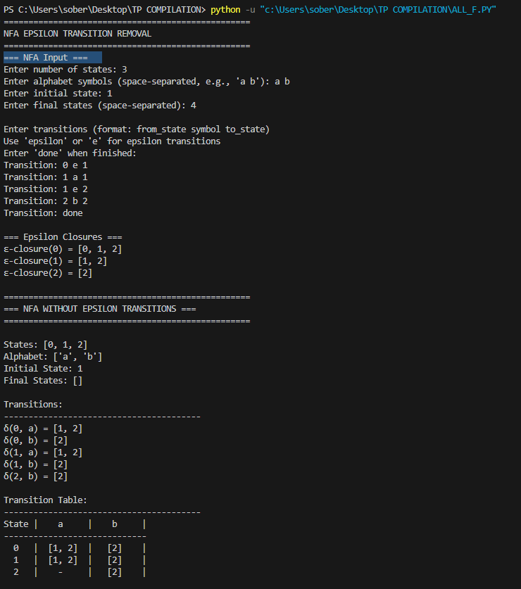

# NFA Epsilon Transition Removal

A Python implementation for removing epsilon (ε) transitions from Non-Deterministic Finite Automata (NFA).

## 🎯 Overview

This program removes epsilon transitions from an NFA, which is an essential step in automata theory before determinization. The implementation follows a modular approach with 5 core functions.

## ✨ Features

- ✅ Read NFA from user input
- ✅ Calculate ε-closure for each state
- ✅ Compute new transitions without epsilon
- ✅ Determine new final states
- ✅ Display results in formatted tables

## 🚀 Getting Started

### Prerequisites

- Python 3.7 or higher

### Installation

1. Clone the repository:
```bash
git clone https://github.com/yourusername/nfa-epsilon-removal.git
cd nfa-epsilon-removal
```

2. Run the program:
```bash
python src/nfa_epsilon_removal.py
```

## 💡 Usage

### Interactive Mode

Run the program and follow the prompts:
```bash
python src/nfa_epsilon_removal.py
```

### Example Input
Number of states: 4
Alphabet symbols: a b
Initial state: 0
Final states: 3
Transitions:
0 e 1
0 e 2
1 a 3
2 b 3
done 


### Example Output
=== Epsilon Closures ===
ε-closure(0) = [0, 1, 2]
ε-closure(1) = [1]
ε-closure(2) = [2]
ε-closure(3) = [3]
=== NFA WITHOUT EPSILON TRANSITIONS ===
States: [0, 1, 2, 3]
Alphabet: ['a', 'b']
Initial State: 0
Final States: [3]
Transition Table:
State |    a     |    b     |
0   |   [3]    |   [3]    |
1   |   [3]    |    -     |
2   |    -     |   [3]    |
3   |    -     |    -     |





